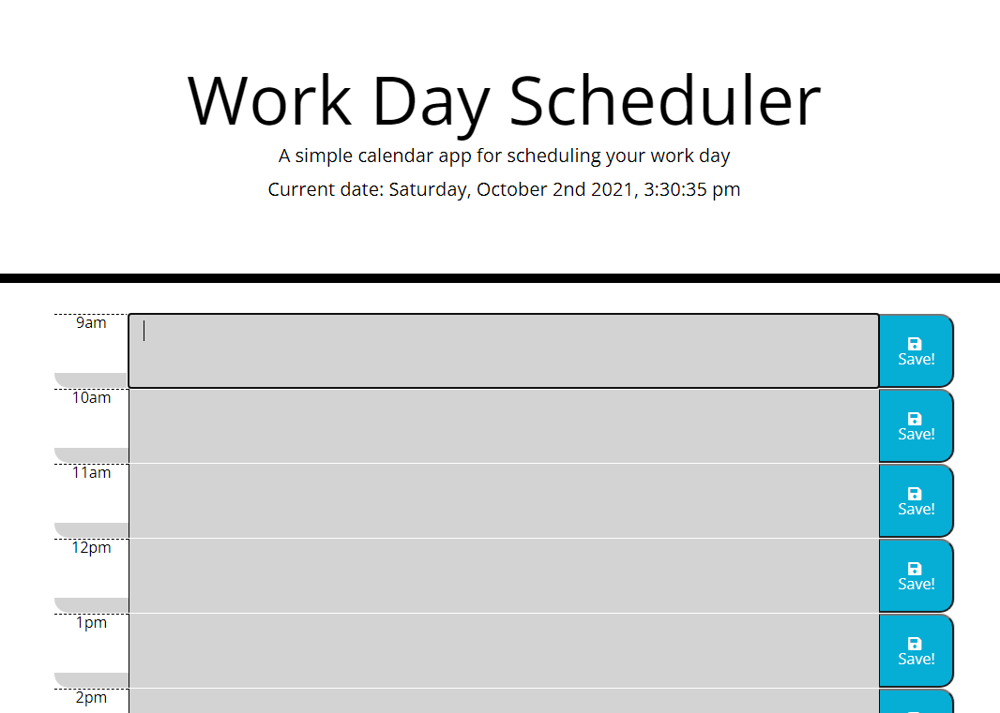

# A Work Day Scheduler!

## Purpose
A personal agenda that is dynamically colored! A place where you can add and save tasks to accomplish in your day!
An exercise in using Moment.js to dynamically change classes, while also using/dynamically changing localstorage based on user input!

## Built With
* HTML
* CSS
* JavaScript
* Bootstrap
* JQuery
* Moment.js

## Website
https://zbreezie.github.io/WorkDayScheduler/

## Contribution
Made with ❤️ by Zachary McCollum
